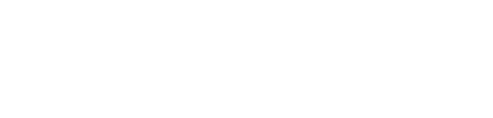
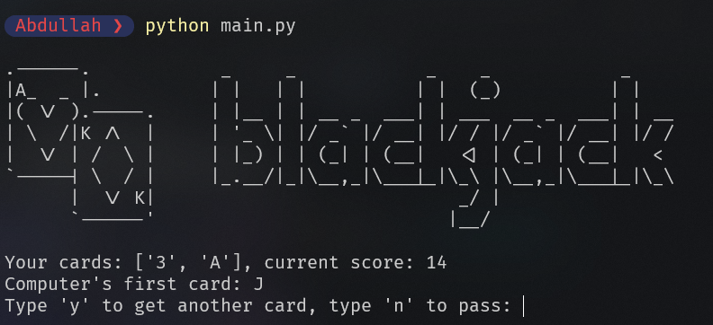

# Blackjack Game

  

Welcome to the **Blackjack Game**! This is a Python-based implementation of the classic casino card game Blackjack. Test your luck and strategy in this exciting game of chance.

## How to Play

1. Run the Python script `blackjack.py` to start the game.
2. You will be dealt two cards from a standard deck.
3. Your goal is to have a hand that adds up to a higher score than the dealer's hand, without exceeding 21 points.
4. The value of cards 2 through 10 is their numerical value. Face cards (J, Q, K) are worth 10 points each, and Aces can be worth 1 or 11 points.
5. You can choose to draw additional cards ("hit") or pass ("stand"). If your hand exceeds 21 points, you bust and lose the game.
6. Once you decide to pass, the dealer will play their turn. The dealer must draw cards until their hand totals at least 17 points.
7. The winner is determined based on the scores of the hands. If your hand is closer to 21 than the dealer's, you win!

## Features

- Play an engaging game of Blackjack right in your terminal.
- Interactive gameplay that allows you to choose whether to draw more cards or pass.
- Realistic scoring system and handling of Ace values.
- Dynamic dealer AI that follows casino rules for drawing cards.

## Screenshots

## Requirements

- Python 3.x

## Installation

1. Clone this repository or download the code files.
2. Ensure you have Python 3.x installed on your machine.
3. Open your terminal and navigate to the directory containing the game files.
4. Run the command: `python blackjack.py`

## Acknowledgments

- ASCII art created using the `art` library.
- Game logic and rules inspired by the classic casino game Blackjack.
